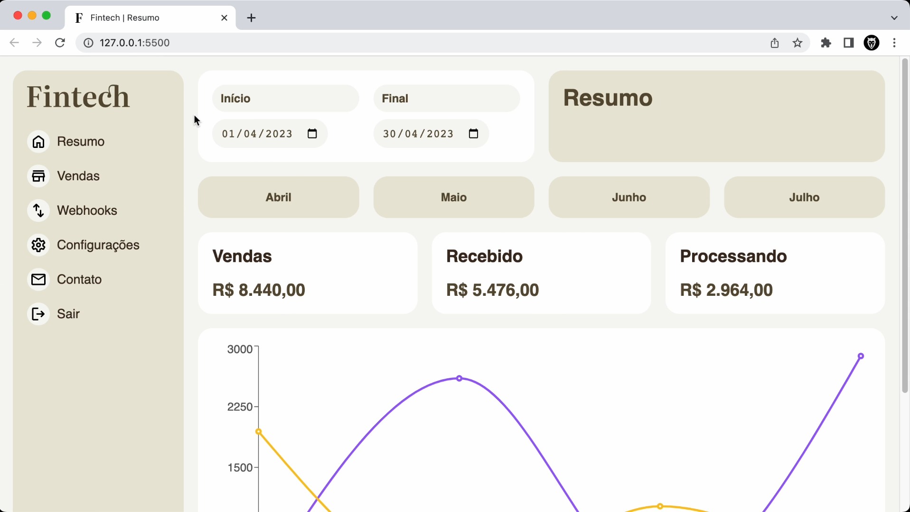

<h1 align="center">📊 Fintech - Sales Dashboard </h1>  

This project is a sales dashboard developed as part of the React with TypeScript course by Origamid. It provides an overview of sales data, including detailed reports, summaries, and insights to help track business performance.
  

  
    
    
    

 

## 🔗 Live Demo  

  

## ✨ Features  
✔️ Sales overview with detailed insights  
✔️ Interactive charts and tables  
✔️ Fully responsive and optimized for all devices  

## 🛠 Tech Stack  
- **React & TypeScript** for frontend development  
- **Styled Components** for styling  
- **Recharts** for data visualization  

🚀 This project is part of my learning journey and showcases best practices in **React, TypeScript, and dashboard development**.  
